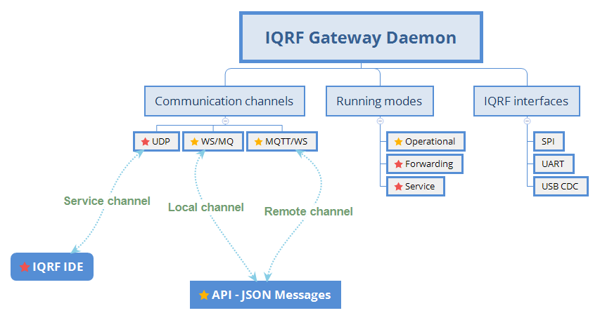

Introduction
============

Open-source components for building IQRF Gateway.

`IQRF Gateway Daemon`_ project provides open-source components for building IQRF 
Gateways based on Linux system. Together they form ready-to-use solution, including 
an user-friendly `IQRF Gateway Webapp`_. Components can be extended or added based 
on the project's requirements. All components are licenced under Apache Licence 2.0 
and can be used for commercial purposes.

IQRF GW daemon
--------------

    Overview

IQRF GW webapp
--------------

.. figure:: images/iqrfgw-overview.png
    :align: center
    :figclass: align-center

    Overview

.. _`IQRF Gateway Daemon`: https://gitlab.iqrf.org/open-source/iqrf-gateway-daemon
.. _`IQRF Gateway Webapp`: https://gitlab.iqrf.org/open-source/iqrf-gateway-webapp

Why v2
------

- Modular design

  - Extendible based on project's requirements
  - Based on `Shape framework`_

- `IQRF Standard`_ supported and exposed as JSON API

  - Working with IQRF Repository
  - Offline cached support

- `IQMESH Services`_ introduced and exposed as JSON API

  - Convenient for system integrators
  - Leaving DPA protocol bits and bytes to us

- `IQRF Generic`_ API is kept alive

  - Working with DPA bits and bytes as in GW Daemon v1

- Reworked IQMESH Manager in `Webapp`_ 

  - Making use of IQMESH Services as mentioned above

- `WebSocket`_ channel introduced
  
  - Enables Docker containers for End-apps more easily
  - TLS secured

- IQRF UART interface supported
  
  - Working with `IQube`_, `UniPi Neuron IQRF`_ and other boards

- Unicast, broadcast and FRC timing supported 

  - GW Daemon knows correct time to wait for DPA response

- API v1 supported

  - Value of v1 applications

- Growing base of `examples and reference apps`_

  - Great inspiration on how to work with our JSON API from your favourite programming language

- Long term `support`_

  - Have trouble, write `daemon issue`_ or `webapp issue`_

.. _`Shape framework`: https://github.com/logimic/shape
.. _`IQRF Standard`: daemon-api.html#iqrf-standard
.. _`IQMESH Services`: daemon-api.html#iqmesh-network
.. _`IQRF Generic`: daemon-api.html#iqrf-generic
.. _`Webapp`: introduction.html#iqrf-gw-webapp
.. _`WebSocket`: https://en.wikipedia.org/wiki/WebSocket
.. _`IQube`: https://docs.iqrf.org/iqd-gw-01
.. _`UniPi Axon IQRF`: https://www.unipi.technology/cs/unipi-axon-s175-iqrf-p322
.. _`examples and reference apps`: https://gitlab.iqrf.org/open-source/iqrf-gateway-daemon/tree/master/examples
.. _`support`: support.html
.. _`daemon issue`: https://gitlab.iqrf.org/open-source/iqrf-gateway-daemon/issues
.. _`webapp issue`: https://gitlab.iqrf.org/open-source/iqrf-gateway-webapp/issues
